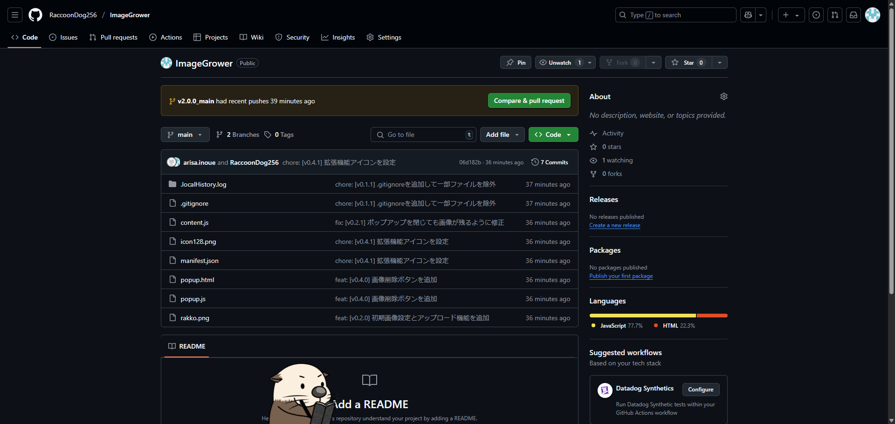

# ImageGrower

**ImageGrower** は、ウェブページ上の画像を拡大表示する Chrome 拡張機能です。
任意の画像を画面の下から生やすことができます🌵

## 特徴

* 画像のプリセット
* 画像のアップロード
* 画像の反転
* 簡単なインストールと使用方法

## デモ

以下は、ImageGrower を使用して画像を表示している例です。



## インストール方法

1. このリポジトリをクローンまたはダウンロードします。

   ```bash
   git clone https://github.com/RaccoonDog256/ImageGrower.git
   ```


2\. Chrome ブラウザで `chrome://extensions/` にアクセスします。
3\. 右上の「デベロッパーモード」を有効にします。
4\. 「パッケージ化されていない拡張機能を読み込む」をクリックし、クローンまたはダウンロードしたフォルダを選択します。

## 使用方法

1. 拡張機能を有効にした状態で、任意のウェブページを開きます。
2. (一部webページのみ)拡張機能をクリックします。
3. 拡張機能をクリックしてポップアップを開き、任意の画像をアップロードすることもできます。

## ファイル構成

* `manifest.json`：拡張機能のメタデータと設定を定義します。
* `content.js`：ウェブページ上で実行され、画像のホバーイベントを処理します。
* `popup.html`：拡張機能のポップアップ UI を定義します。
* `popup.js`：ポップアップ UI の動作を制御します。
* `icon128.png`：拡張機能のアイコンです。
* `rakko.png`：デモ用のサンプル画像です。
